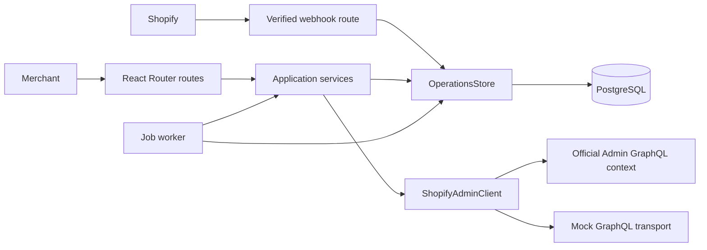
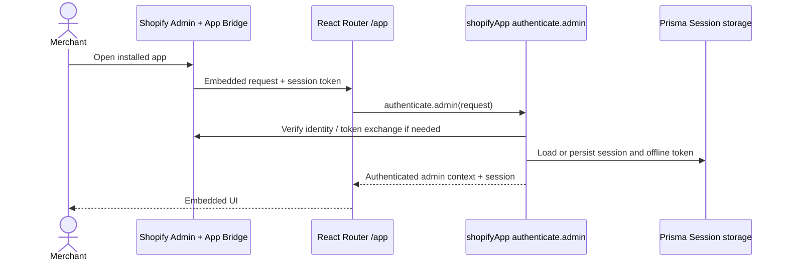
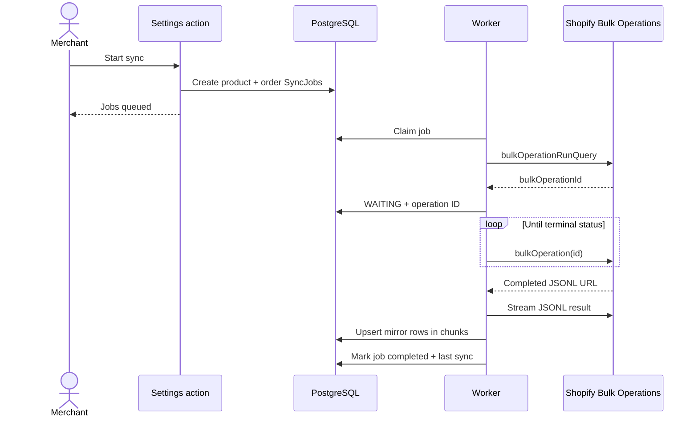
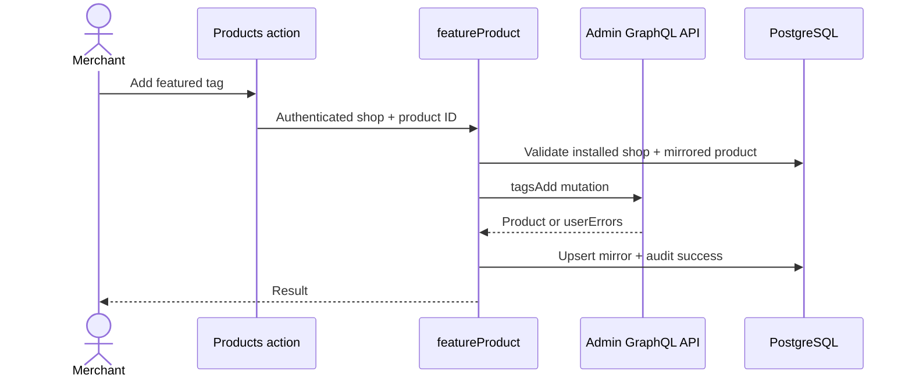
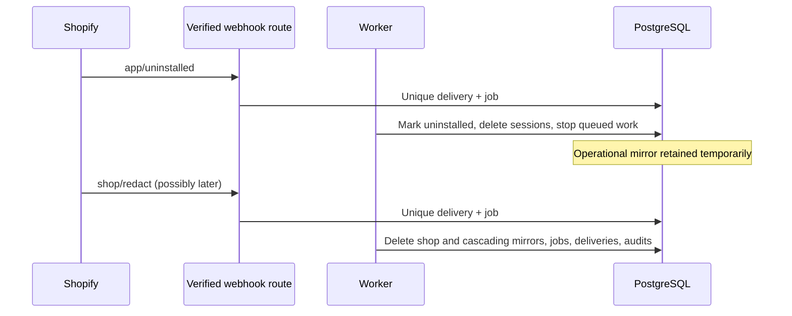

# Architecture

Status: current repository design.

The app has one external integration boundary: `ShopifyAdminClient`. Its live adapter uses the official authenticated Admin GraphQL client; its mock adapter returns realistic GraphQL envelopes and JSONL results. Services never choose a mode. Routes authenticate and validate; services enforce business rules; the store owns durable state; the worker performs asynchronous work.



## 1. Merchant opens installed app



## 2. Normal Admin GraphQL request

```mermaid
sequenceDiagram
  participant Route as Authenticated route / worker
  participant Service as Application service
  participant Client as GraphqlAdminClient
  participant Shopify as Admin GraphQL API
  Route->>Service: shop + validated intent
  Service->>Client: listProducts / getOrder
  Client->>Shopify: Named GraphQL operation via official admin context
  Shopify-->>Client: data/errors + cost metadata
  Client->>Client: Classify errors; retry throttle/temporary failure
  Client-->>Service: Typed domain result
```

## 3. Initial bulk synchronization



## 4. Incremental webhook synchronization

```mermaid
sequenceDiagram
  participant Shopify
  participant Route as /webhooks
  participant Framework as authenticate.webhook
  participant DB as PostgreSQL
  participant Worker
  Shopify->>Route: Delivery + webhook ID + HMAC
  Route->>Framework: Verify raw request
  Framework-->>Route: Verified topic, shop, payload, ID
  Route->>DB: Transaction: unique delivery + job
  Route-->>Shopify: 200 after durable enqueue
  Worker->>DB: Claim job
  Worker->>Shopify: Fetch current product/order state
  Shopify-->>Worker: Current resource
  Worker->>DB: Upsert/delete mirror; mark delivery processed
```

## 5. Merchant-triggered mutation



## 6. Uninstall, then later redaction



## Trace points

Start with `app/routes/app.settings.tsx` for a bulk request, `app/routes/webhooks.tsx` for incremental work, and `app/routes/app.products.tsx` for a Shopify write. The live worker is `scripts/worker.ts`; mock service runs are `scripts/demo.ts`. The schema is the durable state contract.
